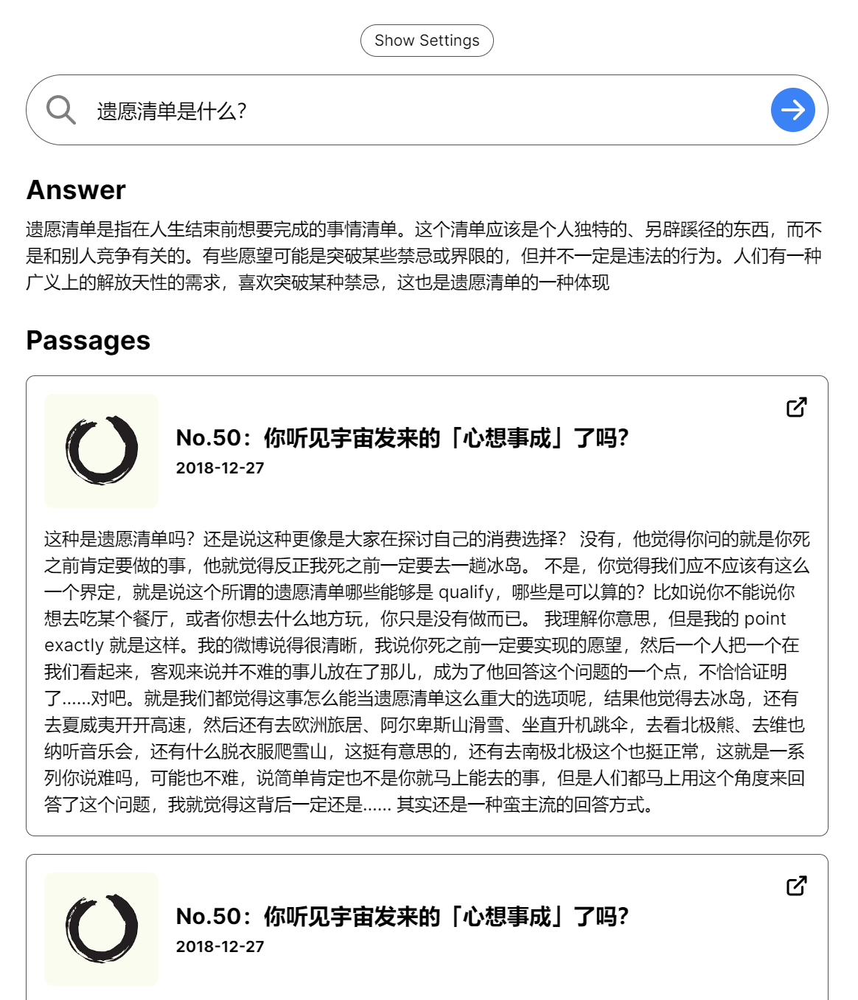

# 《得意忘形》精校文字稿

以[张潇雨为方法](https://pan.baidu.com/s/1HboXmZ7N0rFr66Y45HrODw?pwd=a5ej)系列的第 3 个作品「得意忘形播客转文字稿」，持续更新中。

我和 [84000](https://t.zsxq.com/0cjuUrXYj) 星球同学 @XFFXFF 经过各种各样的努力，上线了「[得意忘形 GPT](https://dywx-gpt.netlify.app/)」，这是个以《得意忘形》内容为基础的 AI 问答库，你向它提问，它会生成回答并附上相关链接（如下图）。

抱歉，现在暂停营业啦 😜

<figure><figcaption></figcaption></figure>

#### 更新日志：

2022-08-14——[#1：扎克伯格的新年挑战，与完成计划为什么总是这么难？](01.md)

2022-08-26——[#50：你听见宇宙发来的「心想事成」了吗？](50.md)

2022-09-02——[#10：「快乐」到底是个什么东西？](10.md)

2022-09-09——[#61：场上没有别人](61.md)

2022-10-23——[#26：人际关系中的三个永恒公理](26.md)

（粗校）2023-04-22——[No.60：感受与生命合一中的爱的扩张](60.md)

（粗校）2023-04-23——[#11：不如我们停止自我攻击，看看会发生什么？](11.md)

（粗校）2023-04-25——[No.41：死亡是凉爽的夜晚](41.md)

（粗校）2023-04-27——[No.57：当你准备好了，你就准备好了](57.md)

（粗校）2023-04-29——[#20：「破题」而不是「答题」——Ask Me Anything 特别节目](20.md)

（由 @杨兴馨 粗校）2023-07-13——[No.64：忆起达克赛德](64.md)


无说明则为 [@](https://nextjs-notion-starter-kit-peach-seven.vercel.app/)[涂俊杰](https://nextjs-notion-starter-kit-peach-seven.vercel.app/) 校对，首发于知识星球「[84000](https://t.zsxq.com/06fqF6uBy)」。



因人力有限，所以为「得意忘形 GPT」增加了粗校版，相比精校，内容准确度降低，比如「他她它」使用错误，少了额外知识点批注等等，请读者见谅。如果你想参与精校或赞助，请联系我（微信：ffeels），在此附上《得意忘形》[机转文字稿](https://pan.baidu.com/s/1S7UHW\_Im1ZM7MleIpMPkvw?pwd=puwh)，方便取用。

